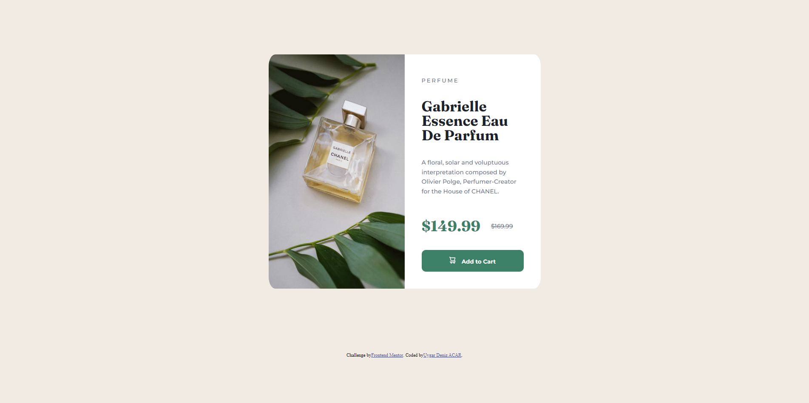
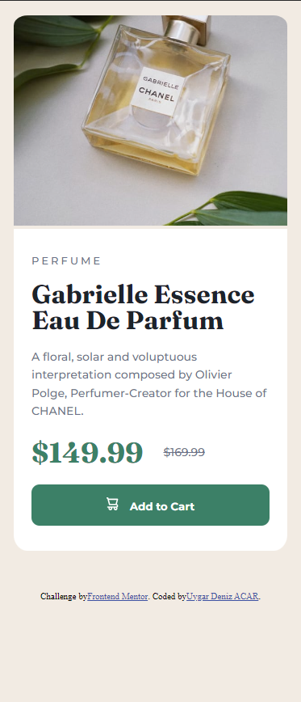

# Frontend Mentor - Product preview card component solution
https://uygardeniz.github.io/Product-preview-card-component-FrontendMentor/
This is a solution to the [Product preview card component challenge on Frontend Mentor](https://www.frontendmentor.io/challenges/product-preview-card-component-GO7UmttRfa). Frontend Mentor challenges help you improve your coding skills by building realistic projects. 

## Table of contents

- [Overview](#overview)
  - [The challenge](#the-challenge)
  - [Screenshot](#screenshot)
  - [Links](#links)
- [Author](#author)

### The challenge

Users should be able to:

- View the optimal layout depending on their device's screen size
- See hover and focus states for interactive elements

### Screenshot

### Links

- Solution URL: https://github.com/UygarDeniz/Product-preview-card-component-FrontendMentor
- Live Site URL: https://uygardeniz.github.io/Product-preview-card-component-FrontendMentor/

## My process

### Built with
- Flexbox
- CSS Grid

## Author

- Frontend Mentor - [@UygarDeniz](https://www.frontendmentor.io/profile/UygarDeniz)
